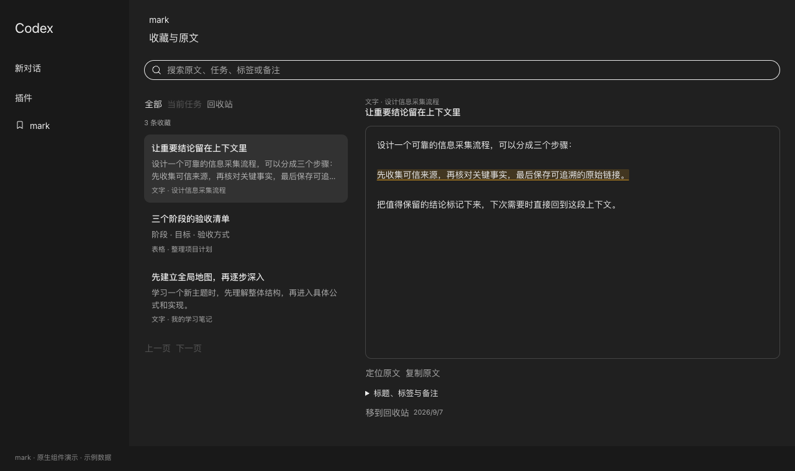
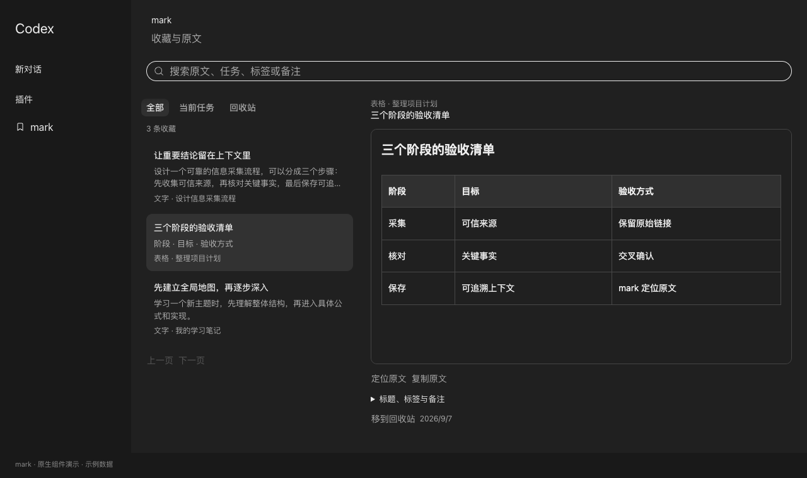

# mark

**把 Codex 里值得留下的内容标记下来，下次直接回到原文。**

选中文字点 **mark**；图片、Mermaid 图表和表格也能保存。通过右侧导航回看当前任务，或在左侧 **mark** 页面搜索所有收藏。

[复制给 Codex 安装](docs/INSTALL.md#复制给-codex-自动安装) · [下载预览版](https://github.com/yinjialu/mark/releases/tag/v0.1.0-preview.7) · [使用说明](docs/USAGE.md) · [适配与开发](DEVELOPMENT.md)

> 开发者预览版。目前界面集成仅支持 **macOS Apple Silicon，Codex 26.901.51231 / build 8109**，还会校验客户端包的完整性。不是 OpenAI 官方项目；其他版本会停止安装，等待适配。

## 效果

收藏库位于 Codex 主内容区，复用原生页面布局、搜索、Tabs 标签切换、按钮和侧边栏组件。文字保留上下文与高亮，表格保留完整行列。





*以上为原生组件独立演示页截图，使用虚构数据；不含真实用户的任务、账号或收藏。演示截图不替代实际客户端验收。*

## 能做什么

- **直接划词**：原生浮栏点 mark，不发送消息；已保存文字显示下划线，再点一次取消。
- **不止文字**：图片、Mermaid 图表、表格旁的书签按钮保存完整内容，再次点击取消。
- **快速回看**：右侧短横线悬停预览、连续波动，点击定位标记。
- **统一收藏库**：左侧 mark 进入原生页面，支持搜索、标签、备注、回收站与恢复。
- **保留来源**：保存来源任务和选区/块位置。精确匹配失败时退到消息或保存时的快照。
- **本地保存**：SQLite 和快照资产留在本机，支持导出和备份；不含跨设备同步。

## 让你的 Codex 帮你安装

把下面这句话发给 Codex，再复制安装文档中包含本地签名与重启授权的完整指令：

```text
请阅读 https://github.com/yinjialu/mark/blob/v0.1.0-preview.7/docs/INSTALL.md，
按照“复制给 Codex 自动安装”部分帮我安装 mark。先确认我的客户端版本兼容。
```

[打开完整安装指令 →](docs/INSTALL.md#复制给-codex-自动安装)

也可下载发布包后双击 **Install.command**。需要 Command Line Tools，标准插件安装另需 Codex CLI。**只安装标准插件不会出现原生界面入口。**

## 安装与升级如何工作

仓库分发「标准 Codex 插件 + 本机界面适配器」，不分发 Codex 客户端。安装器使用**对方 Mac 上已有的正式版**生成独立副本，进行本地签名，只给副本添加 `disable-library-validation` 权限。不会覆盖正式应用或修改系统全局安全设置。

每次通过 `~/Applications/mark.app` 打开时检查正式版。支持的版本自动生成或复用副本；未知版本停止，等待新的 mark 包。切换成功后保留上一已运行版本供回退。启动失败时尝试恢复切换前的客户端。不会自动下载远程补丁。

测试副本复用原有 Codex 用户环境，不是隔离账号。源码兼容性检查、签名检查和进程存活检查不能替代实际点击验收。本包尚未完成第二台 Mac 首装与 Gatekeeper 提示验收，也没有 Developer ID 签名或 Apple 公证。

## 数据和项目结构

默认收藏数据：`~/.local/share/codex-marks/marks.sqlite3`；快照：同目录 `assets/`。备份需保留两者。安装包不含个人数据。停止使用或卸载见[使用说明](docs/USAGE.md#卸载)。

| 路径 | 用途 |
| --- | --- |
| `mark.py` | 检查、构建、安装、切换和回退 |
| `compatibility.json` | 精确匹配的客户端版本与完整性清单 |
| `integration/` | 原生界面与本地 IPC 适配源码 |
| `plugins/codex-marks/` | 标准插件、检索技能与本地收藏脚本 |
| `docs/` | 安装指令、使用说明和示例截图 |
| `tests/` | 安装状态、兼容性、完整性与回退测试 |

MIT 许可适用于本仓库原创代码和文档；客户端与原生组件仍属于其权利人。详见 [NOTICE.md](NOTICE.md)。
