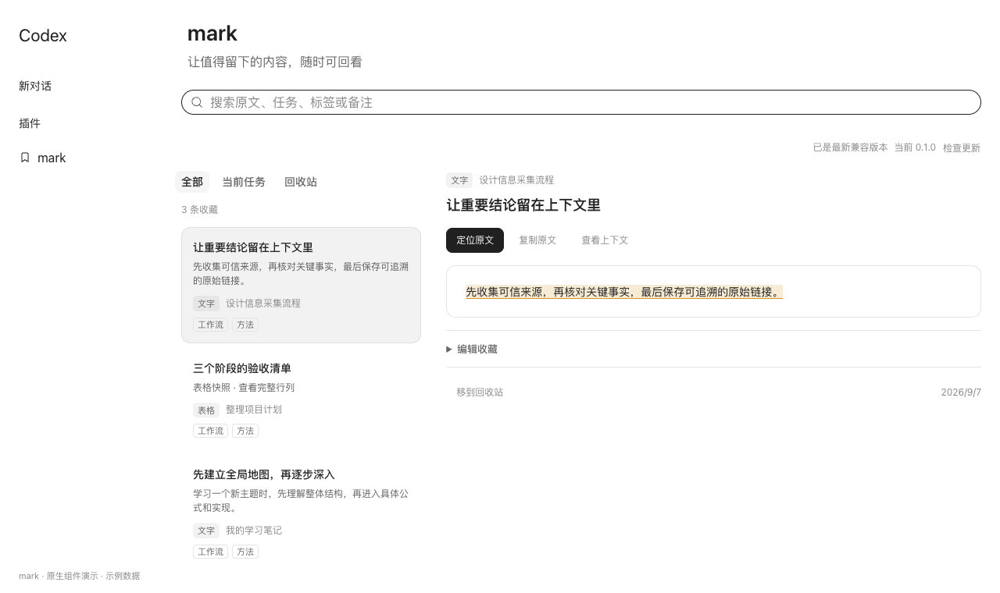
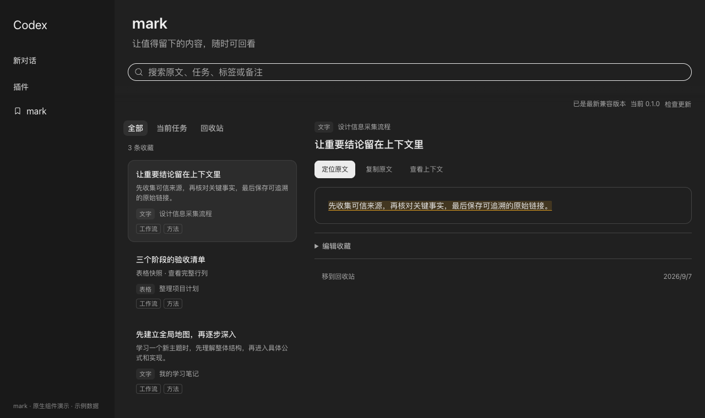
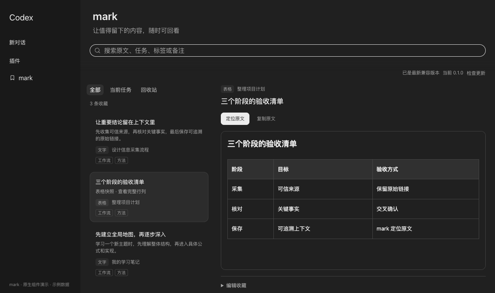
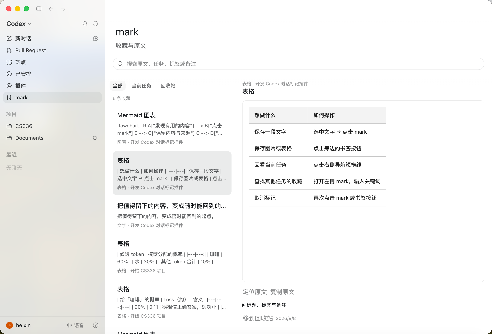
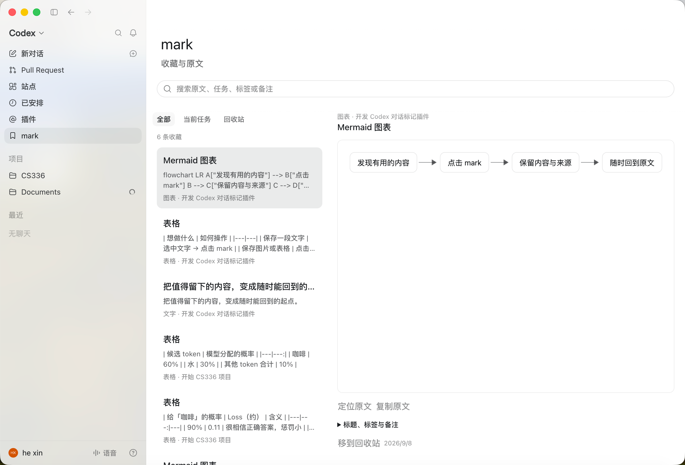

# mark

**把 Codex 里值得留下的内容标记下来，下次直接回到原文。**


选中文字点 **mark**；图片、Mermaid 图表和表格也能保存。通过右侧导航回看当前任务，或在左侧 **mark** 页面搜索所有收藏。

[复制给 Codex 安装](docs/INSTALL.md#复制给-codex-自动安装) · [下载 v0.1.6](https://github.com/yinjialu/mark/releases/tag/v0.1.6) · [使用说明](docs/USAGE.md) · [适配与开发](DEVELOPMENT.md) · [官方目录收录说明](docs/PUBLISHING.md)

> **v0.1.6。** 右侧导航会补全旧收藏缺失的轮次信息，并等待具体文字选区、图片、图表或表格完成挂载，再定位到收藏位置。界面集成支持 **macOS Apple Silicon，ChatGPT 26.908.40834 / build 8881**，并继续支持 **26.901.51231 / build 8109**。安装器会校验客户端版本、构建号、架构和包完整性；其他版本保留当前可用副本并等待适配。本项目不是 OpenAI 官方项目。

## 30 秒上手

1. 日常打开 Dock 中的 **ChatGPT mark**。首次使用通过 `~/Applications/ChatGPT mark.app` 启动，再将运行中的 ChatGPT mark 固定到 Dock。
2. 选中文字点 **mark**；图片、图表和表格点旁边的书签按钮。再次点击可以取消。
3. 当前任务里，用右侧短横线悬停预览、点击定位；跨任务查找，打开左侧 **mark** 收藏库。

Dock 只需保留一个 ChatGPT mark 入口。成功升级或回退后，它会自动指向对应副本；正式版 ChatGPT 保留在“应用程序”里供升级使用。[查看完整使用指南 →](docs/USAGE.md)

macOS 系统搜索支持 `ChatGPT` 和 `mark`。搜索 `ChatGPT` 时会同时显示正式版与唯一的 **ChatGPT mark** 启动入口；内部构建副本不会作为日常入口参与新的 Spotlight 索引。

## 效果

收藏库位于 Codex 主内容区，复用原生页面布局、搜索、Tabs 标签切换、按钮和侧边栏组件。文字保留上下文与高亮，表格保留完整行列。

### 收藏页

打开后自动选择一条收藏。列表显示内容摘要、类型、来源和标签；右侧先展示收藏片段，点击“查看上下文”再展开完整快照。“定位原文”位于详情顶部；编辑标题、标签和备注时会显示未保存状态。



<details>
<summary>查看深色模式和表格预览</summary>





</details>

*以上为新版代码复用本机 Codex 原生组件、在独立浏览器中渲染的示例数据截图，展示页面设计；不是已更新的运行中客户端截图。*

<details>
<summary>查看此前版本的实际客户端截图：表格和 Mermaid 图表</summary>





*用户提供并授权展示的实际客户端截图，拍摄于收藏页调整和更新入口加入之前。*

</details>

## 能做什么

- **直接划词**：原生浮栏点 mark，不发送消息；已保存文字显示下划线，再点一次取消。
- **不止文字**：图片、Mermaid 图表、表格旁的书签按钮保存完整内容，再次点击取消。
- **快速回看**：右侧短横线悬停预览、连续波动，点击定位标记。
- **统一收藏库**：左侧 mark 进入原生页面，支持搜索、标签、备注、回收站与恢复。
- **保留来源**：保存来源任务和选区/块位置。精确匹配失败时退到对应消息或轮次；未找到原文时留在任务中，可主动打开收藏库查看快照。
- **升级不打架**：mark 页点“升级 ChatGPT”即可切到原始正式版完成官方更新；回来后启动器自动适配兼容版本，失败继续使用旧副本。
- **检查 mark 更新**：在收藏页查看兼容适配器，点击“安装并重启”；下载校验通过后切换，失败保留旧版本。
- **本地保存**：SQLite 和快照资产留在本机，支持导出和备份；不含跨设备同步。

## 让你的 Codex 帮你安装

把下面整段发给 Codex：

```text
请帮我安装 https://github.com/yinjialu/mark 的最新兼容版本。
先阅读 README.md、docs/INSTALL.md 和 install.sh，再下载并运行安装脚本；不要固定旧标签。
我同意下载校验后的发布包，生成并本地签名独立的 ChatGPT mark 副本（仅副本启用 disable-library-validation），安装启动器并正常重启切换；保留正式应用、收藏和旧副本。
使用 --yes --no-wait，检查结果文件为 complete 后再报告完成；失败时不绕过兼容性检查。
```

[打开完整安装指令 →](docs/INSTALL.md#复制给-codex-自动安装)

也可[复制终端安装命令](docs/INSTALL.md#自己安装终端复制一次)：自动检查版本、一次确认、显示进度。固定版本安装可下载发布包后双击 **Install.command**。需要 Command Line Tools，标准插件安装另需 Codex CLI。**只安装标准插件不会出现原生界面入口。**

## 安装与升级如何工作

仓库分发「标准 Codex 插件 + 本机界面适配器」，不分发 Codex 客户端。安装器使用**对方 Mac 上已有的正式版**生成独立副本，进行本地签名，只给副本添加 `disable-library-validation` 权限。不会覆盖正式应用或修改系统全局安全设置。

日常 Dock 入口直接打开当前副本。ChatGPT mark 副本不运行官方自更新；在 mark 收藏页点 **升级 ChatGPT**，客户端会安全退出副本并打开原始签名的 ChatGPT，由它完成官方更新。更新结束后重新打开 `~/Applications/ChatGPT mark.app`。启动器会检查新版本：已有精确适配时先生成新版副本再切换；尚未适配或构建失败时继续打开上一可用副本。mark 收藏页分别显示正式版与当前副本版本；同一个 mark 发布包支持新客户端时也会提示“适配新版并重启”，不会误判为已是最新。收藏页每天最多自动检查一次发布信息，也可手动重新检查。只有点击安装按钮才下载和切换；成功后保留当前副本、待切换副本和一个回退副本，并自动清理无引用的历史构建与安装包。内部副本目录不参与新的 Spotlight 索引，减少系统搜索里的重复入口；失败时恢复旧启动器和版本状态。断网不影响现有副本。

新图标使用本项目独立的书签与连续高亮波浪，不使用或改造 OpenAI/ChatGPT 标志；正式版 ChatGPT 保持原图标，Dock 中可以直接区分。

独立副本复用原有 Codex 用户环境，不是隔离账号。源码兼容性检查、签名检查和进程存活检查不能替代实际点击验收。本包尚未完成第二台 Mac 首装与 Gatekeeper 提示验收，也没有 Developer ID 签名或 Apple 公证。

## 数据和项目结构

默认收藏数据：`~/.local/share/codex-marks/marks.sqlite3`；快照：同目录 `assets/`。备份需保留两者。安装包不含个人数据。停止使用或卸载见[使用说明](docs/USAGE.md#卸载)。

| 路径 | 用途 |
| --- | --- |
| `mark.py` | 检查、构建、安装、切换和回退 |
| `compatibility.json` | 精确匹配的客户端版本与完整性清单 |
| `integration/` | 原生界面与本地 IPC 适配源码 |
| `plugins/codex-marks/` | 标准插件、检索技能与本地收藏脚本 |
| `docs/` | 安装指令、使用说明和示例截图 |
| `tests/` | 安装状态、兼容性、完整性与回退测试 |

MIT 许可适用于本仓库原创代码和文档；客户端与原生组件仍属于其权利人。详见 [NOTICE.md](NOTICE.md)。
